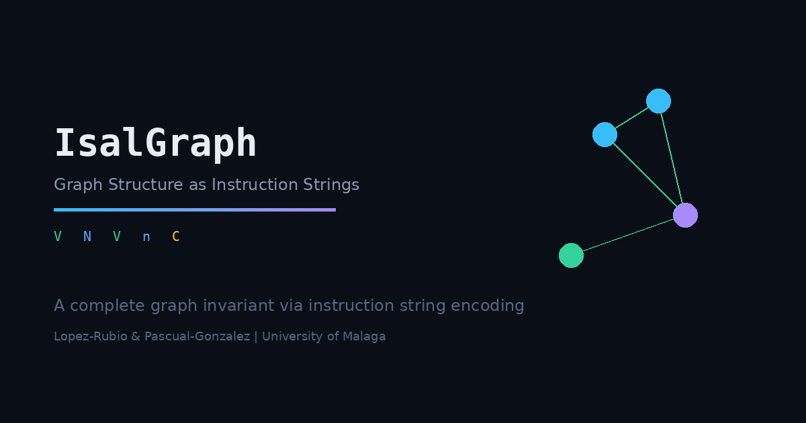
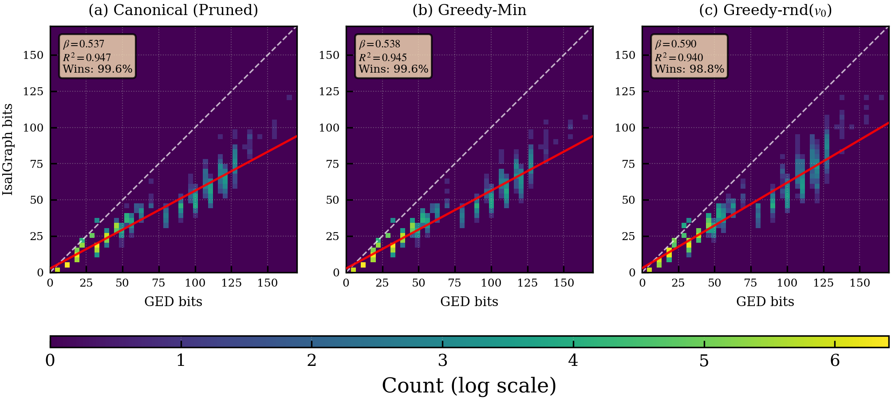
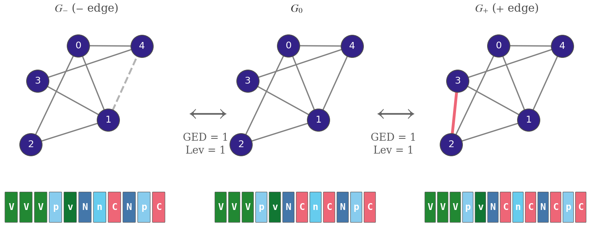
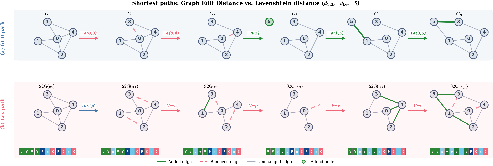

<p align="center">
  
</p>

<p align="center">
  <a href="https://pypi.org/project/isalgraph/"></a>
  <a href="https://pypi.org/project/isalgraph/"></a>
  <a href="https://github.com/MarioPasc/IsalGraph/blob/main/LICENSE"></a>
  <a href="https://mariopasc.github.io/IsalGraph/"></a>
</p>

**IsalGraph** (**I**nstruction **S**et **a**nd **L**anguage for **Graph**s) is a Python library that represents the structure of any finite simple graph as a compact string over a nine-character instruction alphabet. The encoding is executed by a small virtual machine comprising a sparse graph, a circular doubly-linked list (CDLL) of graph-node references, and two traversal pointers.

> Lopez-Rubio, E. and Pascual-Gonzalez, M. (2025). *Representation of Graphs by Sequences of Instructions.* Preprint submitted to Pattern Recognition. [[arXiv:2512.10429](https://arxiv.org/abs/2512.10429)]

## Key Properties

| Property | Description |
|----------|-------------|
| **Universal validity** | Every string over the alphabet `{N, n, P, p, V, v, C, c, W}` decodes to a valid finite simple graph. No invalid states exist. |
| **Reversibility** | The greedy `GraphToString` algorithm encodes any connected graph into a string *w* such that `S2G(w)` is isomorphic to the input. |
| **Canonical completeness** | The canonical string *w\** is a complete graph invariant: *w\*_G = w\*_H* if and only if *G* and *H* are isomorphic. Formally proved via structural-triplet pruning. |
| **Metric locality** | The Levenshtein distance between IsalGraph strings correlates strongly with graph edit distance (GED), enabling fast structural comparison. |

## Installation

The core library has **zero dependencies** (Python standard library only).

```bash
pip install isalgraph
```

With optional adapters for graph libraries:

```bash
pip install isalgraph[networkx]     # NetworkX adapter
pip install isalgraph[igraph]       # igraph adapter
pip install isalgraph[pyg]          # PyTorch Geometric adapter
pip install isalgraph[all]          # Everything
```

**Requires Python >= 3.10.**

## Quick Start

### Encode a graph as a string

```python
from isalgraph import SparseGraph, GraphToString

# Build a triangle: 0--1--2--0
g = SparseGraph(max_nodes=3, directed_graph=False)
g.add_node(); g.add_node(); g.add_node()
g.add_edge(0, 1); g.add_edge(1, 2); g.add_edge(2, 0)

gts = GraphToString(g)
string, trace = gts.run(initial_node=0)
print(string)  # e.g. "VVPnC"
```

### Decode a string back to a graph

```python
from isalgraph import StringToGraph

stg = StringToGraph("VVPnC", directed_graph=False)
graph, trace = stg.run()
print(graph.node_count())          # 3
print(graph.logical_edge_count())  # 3
```

### Compute canonical strings (complete graph invariant)

```python
from isalgraph import GreedyMinG2S, ExhaustiveG2S

# Greedy-min: fast polynomial encoding (default)
algo = GreedyMinG2S()
w_greedy = algo.encode(g)

# Exhaustive: true canonical string (complete invariant)
algo = ExhaustiveG2S()
w_canonical = algo.encode(g)
```

### Use with NetworkX

```python
import networkx as nx
from isalgraph.adapters.networkx_adapter import NetworkXAdapter

adapter = NetworkXAdapter()

# NetworkX graph -> IsalGraph string
G = nx.petersen_graph()
sg = adapter.from_external(G, directed=False)
string = GreedyMinG2S().encode(sg)

# IsalGraph string -> NetworkX graph
G_recovered = adapter.from_isalgraph_string(string, directed=False)
assert nx.is_isomorphic(G, G_recovered)
```

### Use with PyTorch Geometric

```python
from torch_geometric.data import Data
from isalgraph.adapters.pyg_adapter import PyGAdapter

adapter = PyGAdapter()

# PyG Data -> IsalGraph string -> PyG Data
data = Data(edge_index=edge_index, num_nodes=n)
sg = adapter.from_external(data, directed=False)
string = GreedyMinG2S().encode(sg)
data_recovered = adapter.from_isalgraph_string(string, directed=False)
```

## The Instruction Set

The IsalGraph virtual machine maintains three components: a graph *G*, a circular doubly-linked list *L*, and two pointers (*primary* and *secondary*). Nine instructions manipulate this state:

| Instruction | Type | Effect |
|:-----------:|------|--------|
| `N` / `P` | Primary move | Move primary pointer forward / backward in the CDLL |
| `n` / `p` | Secondary move | Move secondary pointer forward / backward in the CDLL |
| `V` | Node via primary | Add new node *u* to *G*; add edge from primary's graph node to *u*; insert *u* into CDLL after primary |
| `v` | Node via secondary | Same as `V` but via secondary pointer |
| `C` | Edge (primary -> secondary) | Add edge between graph nodes at current pointer positions |
| `c` | Edge (secondary -> primary) | Reverse of `C` (differs from `C` only for directed graphs) |
| `W` | No-op | State unchanged |

Every string over this alphabet produces a valid graph -- there are no invalid states.

## Encoding Algorithms

Three encoding strategies are provided, spanning the speed-quality trade-off:

| Algorithm | Class | Complexity | Description |
|-----------|-------|-----------|-------------|
| **Greedy-rnd(*v*_0)** | `GreedySingleG2S` | *O*(*T*_greedy) | Single greedy run from one starting node. Fastest. |
| **Greedy-Min** | `GreedyMinG2S` | *O*(*N* * *T*_greedy) | Greedy from all starting nodes, returns lexmin shortest. Default. |
| **Canonical (Pruned)** | `PrunedExhaustiveG2S` | Exponential (pruned) | Backtracking search with structural-triplet pruning. Complete invariant. |
| **Canonical (Exhaustive)** | `ExhaustiveG2S` | Exponential | Full backtracking search. Complete invariant. |

## Empirical Results

Evaluated on five real-world graph benchmark datasets (IAM Letter LOW/MED/HIGH, LINUX, AIDS) with exact GED ground truth.

### Message Length Compactness

IsalGraph encodings require between 53% and 74% of the bits needed by the GED standard construction model.

<p align="center">
  
</p>

*OLS regression slopes* beta *< 1 across all methods and datasets confirm systematic compression. Canonical (Pruned): beta = 0.537, R^2 = 0.947; Greedy-Min: beta = 0.538, R^2 = 0.945. IsalGraph produces shorter bit representations for 99.6% of graphs.*

### Metric Locality

Local changes in graph structure produce bounded changes in the instruction string. The Levenshtein distance between canonical strings approximates GED.

<p align="center">
  
</p>

*Single edge edit (GED = 1) produces small, localised changes in the IsalGraph canonical string (Levenshtein distance = 1), illustrating metric locality.*

<p align="center">
  
</p>

*Shortest paths between two graphs under GED (top) and Levenshtein distance (bottom). Both distances equal 5 but traverse entirely different sequences of intermediate graphs.*

## Architecture

```
isalgraph/
  core/               # Zero external dependencies (stdlib only)
    cdll.py           # Array-backed circular doubly-linked list
    sparse_graph.py   # Adjacency-set graph representation
    string_to_graph.py  # S2G: string -> graph decoder
    graph_to_string.py  # G2S: graph -> string encoder
    canonical.py      # Exhaustive canonical string search
    canonical_pruned.py # Structural-triplet pruned canonical search
    algorithms/       # G2S algorithm implementations
  adapters/           # Optional bridges to graph libraries
    networkx_adapter.py
    igraph_adapter.py
    pyg_adapter.py
  types.py            # Type aliases
  errors.py           # Exception hierarchy
```

The core has **zero external dependencies**. Adapters import their respective libraries independently.

## Development

```bash
git clone https://github.com/MarioPasc/IsalGraph.git
cd IsalGraph
pip install -e ".[dev]"

# Run tests
python -m pytest tests/unit/ -v                       # Unit tests
python -m pytest tests/integration/ -v                # Integration tests
python -m pytest tests/property/ -v                   # Property-based tests
python -m pytest tests/ -v --cov=isalgraph             # Full suite with coverage

# Lint and type check
python -m ruff check --fix src/ tests/
python -m ruff format src/ tests/
python -m mypy src/isalgraph/
```

## Interactive Documentation

The [project website](https://mariopasc.github.io/IsalGraph/) includes:

- Step-by-step algorithm visualisations for S2G and G2S
- An interactive playground for encoding and decoding graphs
- A graph explorer for navigating IsalGraph string neighbourhoods

## Citation

If you use IsalGraph in your research, please cite:

```bibtex
@article{lopezrubio2025isalgraph,
  title   = {Representation of Graphs by Sequences of Instructions},
  author  = {L{\'o}pez-Rubio, Ezequiel and Pascual-Gonz{\'a}lez, Mario},
  journal = {Preprint submitted to Pattern Recognition},
  year    = {2025},
  note    = {arXiv:2512.10429}
}
```

## License

MIT License. See [LICENSE](LICENSE) for details.
